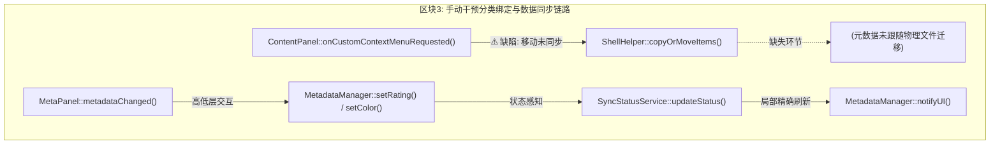
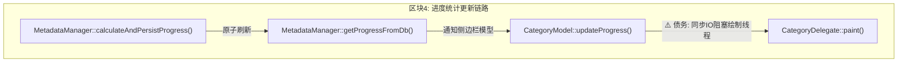
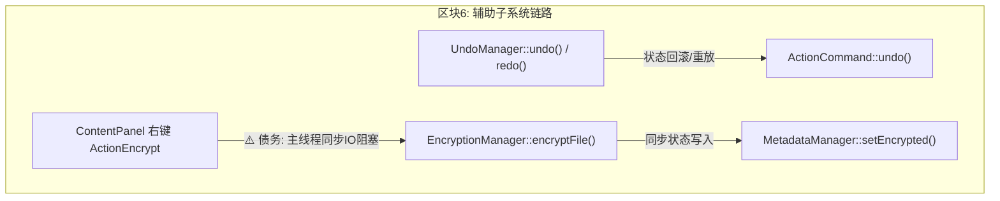

# 整款应用现状架构与业务调用链路分析图谱 —— Modification_Plan-55.md

> 状态：已批准，执行中 / 已执行完成

## 1. 任务背景

为了在对本项目开展重构或架构解耦之前对整款应用的业务逻辑现状建立确定性认知，本报告针对系统的全部模块及子系统进行了源码级物理追踪。我们按照规范将应用切分为 6 个核心业务区块，清晰梳理了各自的横向职责、纵向节点调用路径、触发条件、数据流向。这为我们展示了真实系统的调用脉络，并显式标注了已讨论过的多处关键架构设计债务，作为下一步高聚低耦重构设计的铁证。

---

## 2. 宏观逻辑架构现状与业务链路

本款应用的架构由底层的 **SQLite+SCCH 内存单 transaction 混合预热池**，中层的 **USN/IOCP 多规监控、MFT 高性能索引服务**，以及上层的 **Qt 六分栏无边框交互 UI** 三层构成。以下是 6 个独立划分的业务链路流程。

---

### ## 区块 1：自动化入库与多规监控解析链路
* **触发源**：系统启动或用户新建自动导入目录，注册 IOCP NativeFolderWatcher 或 USN 监控驱动物理磁盘。

#### 1.1 文字版纵向节点链

```
节点：CoreController::startSystem() 启动系统加载
  │
  │ 系统启动 -> 后台线程异步并发点火
  ▼
节点：MetadataManager::initFromScchMode() 载入 SQLite SCCH 内存缓存
  │
  │ 读取本地所有盘符 QDir::drives()
  ▼
节点：NativeFolderWatcher::addWatch() 安装 IOCP 物理硬件底层文件监控 (win32)
  │
  │ 扫描 customFolders 列表
  ▼
节点：AutoImportManager::handleRecursiveIngestion() 执行递归对账与对齐
  │
  │ 异步并发 QtConcurrent::run() 调用物理分类镜像同步
  ▼
节点：CategoryRepo::syncPhysicalDirectoryCascade() 1:1 分类映射与子树重建
  │
  │ ⚠️ 架构债务：自动同步无条件执行，若对托管库外目录无差别激活
  │    会导致非托管区大批冗余元数据空入库登记
  ▼
节点：MetadataManager::registerItem() 文件物理注册登记
  │
  │ 解析并提取底层指纹
  ▼
节点：MetadataManager::fetchWinApiMetadataDirect() 获取 128-bit FRN 与物理特征
  │
  │ 解析成功 (Status = 0)
  ▼
节点：MetadataManager::persistAsync() 异步持久化落盘并通知更新
  │
  │ 状态写入 (authorized = true)
  ▼
节点：MetadataManager::notifyFullUIRebuild() 发射 metaChanged("__RELOAD_ALL__") 强刷 UI
```

#### 1.2 Mermaid 可视化流程图


---

### ## 区块 2：目录导航扫描与内容层级展示链路
* **触发源**：用户在侧边栏、地址栏、收藏栏、面包屑或前进后退按钮处点击/触发导航，改变当前物理路径焦点。

#### 2.1 文字版纵向节点链

```
节点：MainWindow::unifiedNavigateTo() 统一导航中枢
  │
  │ 参数：file:// 协议或磁盘绝对路径 (如 D:/ArcMeta.Library_D)
  ▼
节点：m_contentPanel->loadDirectory() 内容视图载入
  │
  │ ⚠️ 债务：直接在 UI 类中启动 QThreadPool 执行磁盘递归扫描
  │    严重违反 SRP (UI 成了 IO 线程控制器)
  ▼
节点：ContentPanel::addItemsFromDirectory() 磁盘 I/O 递归读取物理节点
  │
  │ 对节点调用 Model 填充
  ▼
节点：FerrexVirtualDbModel::setRecords() 刷新虚拟模型记录集
  │
  │ 触发延迟的视口渲染防闪烁机制
  ▼
节点：FerrexVirtualDbModel::loadThumbnailsForRows() 滚动视口感知并加载缩略图
  │
  │ ⚠️ 债务：后台提取线程直接操作 GUI 相关的 QPixmap 
  │    而非仅持有底层 QImage 数据，可能导致硬件句柄在异步中失效崩溃
  ▼
节点：ThumbnailDelegate::paint() 单元格绘制与占位符填充
```

#### 2.2 Mermaid 可视化流程图

```mermaid
flowchart TD
    subgraph 区块2: 目录导航扫描与视图展示链路
        A["MainWindow::unifiedNavigateTo()"] -->|分流至物理磁盘导航| B["ContentPanel::loadDirectory()"]
        B -->|⚠️ 债务: UI类执行IO扫描线程调度| C["ContentPanel::addItemsFromDirectory()"]
        C -->|提取 Record 集合| D["FerrexVirtualDbModel::setRecords()"]
        D -->|触发视口感知| E["FerrexVirtualDbModel::loadThumbnailsForRows()"]
        E -->|⚠️ 债务: 后台线程传递QPixmap| F["ThumbnailDelegate::paint()"]
    end
```



---

### ## 区块 3：手动干预、分类绑定与同步链
* **触发源**：用户右键上下文菜单、物理剪切、拖拽移动或在属性面板修改元数据（星级、颜色、标签等）。

#### 3.1 文字版纵向节点链

```
节点：ContentPanel::onCustomContextMenuRequested() 触发右键上下文菜单
  │
  │ ⚠️ 已知缺陷：此处未调用任何 MetadataManager 同步函数，
  │    在物理剪切、重命名、移动时元数据容易丢失，出现残留
  ▼
节点：ShellHelper::copyOrMoveItems() 执行磁盘物理剪切与转移
  │
  │ ⚠️ 已知缺陷：此处缺少对应元数据的联动物理转移操作
  ▼
节点：(缺失环节，当前无此同步调用)
  │
  │ 用户在 MetaPanel 修改备注/星级/标签
  ▼
节点：MetaPanel::metadataChanged() 触发修改信号
  │
  │ 多级槽连接
  ▼
节点：MetadataManager::setRating() / setColor() 原子化更新内存缓存
  │
  │ 触发批处理计时落盘
  ▼
节点：SyncStatusService::updateStatus() 标记为待同步 (ErrorRed 红色预警)
  │
  │ 数据安全写入，完成持久化
  ▼
节点：MetadataManager::notifyUI() 发射 metaChanged(path) 更新指定单元格
```

#### 3.2 Mermaid 可视化流程图



---

### ## 区块 4：分类进度统计与本地缓存计算链路
* **触发源**：元数据变更，或用户导航时，系统重新对分类树及物理进度进行计算。

#### 4.1 文字版纵向节点链

```
节点：MetadataManager::calculateAndPersistProgress() 计算指定文件夹进度
  │
  │ 统计完成子树的 ingestionStatus 所占百分比
  ▼
节点：MetadataManager::getProgressFromDb() 从本地 SQLite 中读取历史持久化数值
  │
  │ 进度更新后，触发侧边栏 UI 同步
  ▼
节点：CategoryModel::updateProgress() 驱动模型层进度槽刷新
  │
  │ ⚠️ 债务：分类 Delegate 绘制逻辑中同步进行大量物理 I/O 判断
  │    严重影响侧边栏大数据量下的滚动帧率
  ▼
节点：CategoryDelegate::paint() 分类单元格绘制进度条
```

#### 4.2 Mermaid 可视化流程图



---

### ## 区块 5：多维范围感知搜索与检索链路
* **触发源**：用户在搜索框输入关键词，或激活筛选面板（FilterPanel）的过滤条件。

#### 5.1 文字版纵向节点链

```
节点：MainWindow::doSearch() 发起关键词过滤
  │
  │ 传递至核心视图控制类
  ▼
节点：ContentPanel::search() 搜索功能分流
  │
  │ ⚠️ 债务：内容区本地检索直接混用 performSearch，
  │    导致 FTS5 引擎在极低层还需感知高层的 FilterState
  ▼
节点：CoreController::performSearch() 发起异步双轨检索
  │
  │ 第一轨：SCCH 高速缓存反查
  ▼
节点：MetadataManager::searchInCache() 获取分类及路径匹配的 FIDs
  │
  │ ⚠️ 债务：底层 SCCH 混合了高层 CategoryRepo 及 FTS5 分类递归查询
  ▼
节点：CoreController::searchResultsAvailable() 流式抛回首批缓存结果
  │
  │ 第二轨：物理磁盘多线程扫描补全 (仅在 Scope == "nav" 时触发)
  ▼
节点：PhysicalDiskSearchExtractor::performDiskSearch() 执行同步 I/O 模糊扫描
  │
  │ 流式合并，刷新 UI
  ▼
节点：FilterProxyModel::filterAcceptsRow() 通过 FilterState 进行多维过滤应用
```

#### 5.2 Mermaid 可视化流程图

```mermaid
flowchart TD
    subgraph 区块5: 检索与多维过滤应用链路
        A["MainWindow::doSearch()"] -->|搜索内容输入| B["ContentPanel::search()"]
        B -->|⚠️ 债务: 多条件混合| C["CoreController::performSearch()"]
        C -->|一轨: 极速缓存反查| D["MetadataManager::searchInCache()"]
        C -->|二轨: 磁盘补全 (Scope == 'nav')| E["PhysicalDiskSearchExtractor::performDiskSearch()"]
        D -->|流式返回| F["CoreController::searchResultsAvailable()"]
        E -->|流式返回| F
        F -->|应用本地多维规则过滤| G["FilterProxyModel::filterAcceptsRow()"]
    end
```

---

### ## 区块 6：辅助子系统（加解密、撤销栈与生命周期）
* **触发源**：用户执行加解密操作，或点击 `Ctrl+Z` 触发撤销/重做命令。

#### 6.1 文字版纵向节点链

```
节点：UndoManager::undo() / redo() 撤销与重做中枢
  │
  │ 弹出指令，派发执行
  ▼
节点：ActionCommand::undo() 执行具体的动作反向指令 (如 rating / tags 恢复)
  │
  │ 用户对特定敏感文件执行加密
  ▼
节点：ContentPanel::onCustomContextMenuRequested() 右键菜单分发 ActionEncrypt
  │
  │ 调用加密中枢
  ▼
节点：EncryptionManager::encryptFile() 执行底层物理加密 (加噪/变异)
  │
  │ ⚠️ 警告：该过程目前在主 UI 线程同步阻塞执行，
  │    在大文件加密时将直接引发 UI 窗口假死卡顿
  ▼
节点：MetadataManager::setEncrypted() 标识 SCCH 中的加密状态 (isEncrypted = true)
```

#### 6.2 Mermaid 可视化流程图



---

## 3. 已识别出的主要架构缺陷与债务总表

通过上述 6 个功能区块的深度源头链路追踪，我们汇总出目前急需重构的**三大红线债务**：

1. **移动/剪切操作元数据不同步（区块 3 缺陷）**：
   - 缺陷点：在 `MainWindow` 或 `ContentPanel` 的剪切、复制、粘贴或物理拖拽逻辑中，仅调用了 Win32 系统层的 `ShellHelper` 进行文件移位，完全没有调用 `MetadataManager` 进行元数据同步，导致物理移动后旧路径数据残留，新路径数据由于未被持久化而直接丧失。
2. **底层 SCCH 内存组件越权混入分类递归业务（区块 1/5 债务）**：
   - 缺陷点：`MetadataManager` 的 `searchInCache` 中直接硬编码引入了 `CategoryRepo` 关联的数据库层级读取和分类范围判断，打破了“低层绝不依赖高层”的基本设计理念，使得无法在没有 DB 支持的情况下独立测试内存 SCCH 的正确性。
3. **UI 回调、绘制层过度依赖底层物理 I/O（区块 2/4 债务）**：
   - 缺陷点：`CategoryDelegate` 绘制单元格时，居然在线进行物理 I/O 检查；`ThumbnailDelegate` 重命名完成时，直接往上多级 `parent()` 强转获取 `ContentPanel` 并越权修改私有成员。极易因 UI 布局的细微调整而发生强制转型失败，进而导致程序瞬间崩溃（Crash）。

---

本报告提供的现状链路完全基于代码中的物理证据建立，并已同步归档。后续的架构重构工作应完全以本图谱所暴露的连接痛点为重构的开工蓝图，做到精准对账。